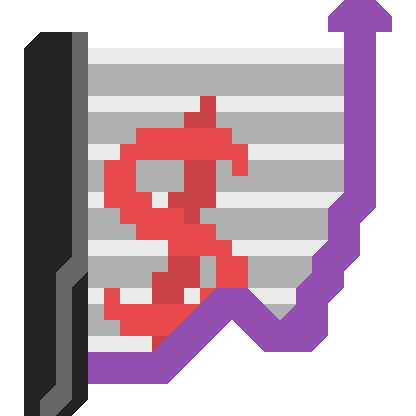

# AshFinances

AshFinances is a console application powered by [AshConsoleGraphics](https://github.com/siljamdev/AshConsoleGraphics) that will help you keep track of money and transactions.
**The application will only work in an interactive console**

## Usage
On the first boot, you will be prompted to input your starting balance. All numbers are floating point numbers.  
Then, you have access to the menu, where you move around with arrows and click buttons with enter. You can go back with escape  
You can add a transaction in the current day, in a past day, or see stats and transactions.  
All dates are in the format dd/mm/yyyy, if you use any other format you should get a long holiday and spend some time thinking where it all went wrong.

## Installation
You can install AshFinances for windows x64 or x86 with the portable executable.
There are no pre built executables for linux or mac but it should be compatible, you could build it.

## CLI
It also has a minimal CLI for adding transactions. You can do `ashfinances -h` to get a complete help menu.

## Config
The config is an ashfile found at `%appdata%/ashproject/ashfinances/config.ash`. You can change it with the in-app menu.

## License
This software is licensed under the [MIT License](https://github.com/siljamdev/AshFinances/blob/main/LICENSE).

## Internal operation
The app folder is in %appdata%/ashproject/ashfinances, and in there there is an [AshFile](https://github.com/Dumbelfo08/AshLib) (days.ash) that holds all information.

## Security disclaimer
This application stores you data in a plain .ash file, [it could be read by anyone](https://github.com/siljamdev/AshFile-Editor). Please dont use this application with any sensitive data.
